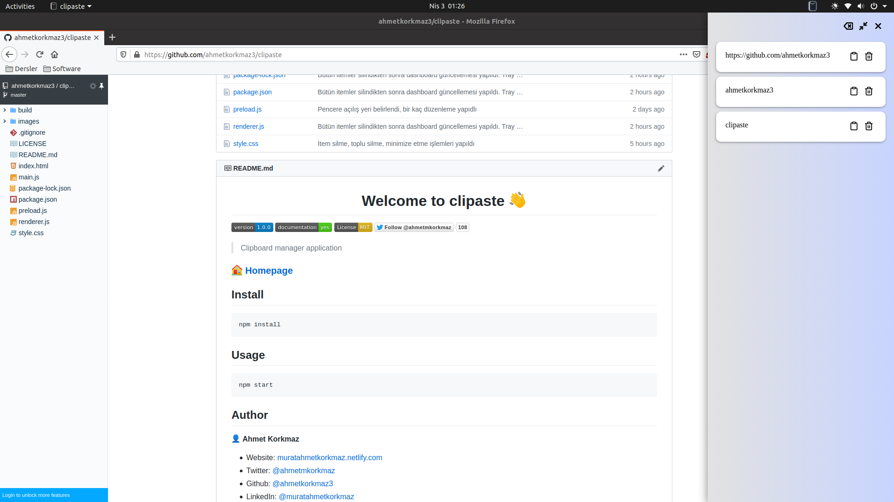
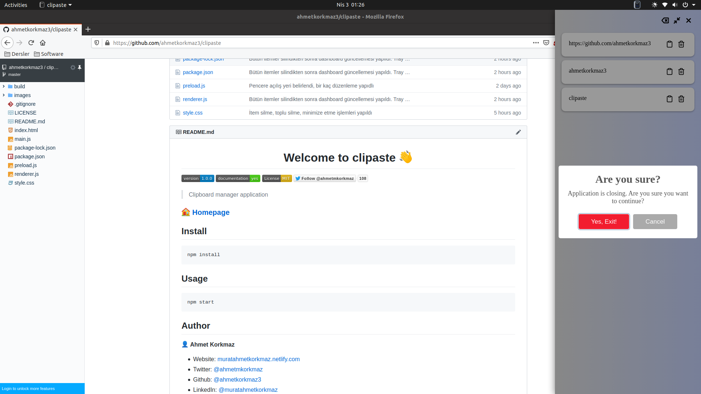

<h1 align="center">Welcome to clipaste 👋</h1>
<p>
  
  <a href="https://snapcraft.io/clipaste">
    
  </a>
  <a href="https://github.com/ahmetkorkmaz3/clipaste" target="_blank">
    
  </a>
  <a href="https://github.com/ahmetkorkmaz3/clipaste/blob/master/LICENSE" target="_blank">
    
  </a>
  <a href="https://twitter.com/ahmetmkorkmaz" target="_blank">
    
  </a>
</p>

> Clipboard manager application. (Ctrl+Shift+9) Shorcuts is open dashboard.

## Install with Snapcraft

[](https://snapcraft.io/clipaste)

## Screenshots




## Install

```sh
npm install
```

## Usage

```sh
npm start
```

## Author

👤 **Ahmet Korkmaz**

* Website: [muratahmetkorkmaz.netlify.com](https://muratahmetkorkmaz.netlify.com)
* Twitter: [@ahmetmkorkmaz](https://twitter.com/ahmetmkorkmaz)
* Github: [@ahmetkorkmaz3](https://github.com/ahmetkorkmaz3)
* LinkedIn: [@muratahmetkorkmaz](https://linkedin.com/in/muratahmetkorkmaz)

## Show your support

Give a ⭐️ if this project helped you!

## 📝 License

Copyright © 2020 [Ahmet Korkmaz](https://github.com/ahmetkorkmaz3).<br />
This project is [MIT](https://github.com/ahmetkorkmaz3/clipaste/blob/master/LICENSE) licensed.

***
_This README was generated with ❤️ by [readme-md-generator](https://github.com/kefranabg/readme-md-generator)_