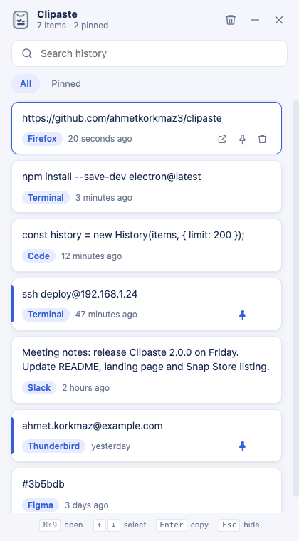

<p align="center">
  
</p>

<h1 align="center">Clipaste</h1>

<p align="center">
  Your clipboard history, one shortcut away.<br />
  A free, open-source clipboard manager for Linux, macOS and Windows.
</p>

<p align="center">
  <a href="https://github.com/ahmetkorkmaz3/clipaste/releases/latest"></a>
  <a href="https://snapcraft.io/clipaste"></a>
  <a href="https://github.com/ahmetkorkmaz3/clipaste/actions/workflows/ci.yml"></a>
  <a href="LICENSE"></a>
</p>

<p align="center">
  <a href="https://ahmetkorkmaz3.github.io/clipaste/"><strong>Website</strong></a> ·
  <a href="#install">Install</a> ·
  <a href="#usage">Usage</a> ·
  <a href="CHANGELOG.md">Changelog</a>
</p>

<p align="center">
  
</p>

## Features

- **Clipboard history**: Clipaste records each text you copy, in any app.
- **Source app**: each item shows the app you copied it from.
- **Search**: start to type and the list filters immediately.
- **Pin**: pinned items are never trimmed and stay when you clear the history.
- **Keyboard first**: open with a shortcut, select with the arrow keys, copy with <kbd>Enter</kbd>.
- **Private**: the history stays on your computer. Clipaste skips secrets that password managers mark as concealed.
- **Light and dark theme**: Clipaste follows your system theme.
- **Tray menu**: recent items, pause recording, start at login and history size.

## Install

### Linux

[](https://snapcraft.io/clipaste)

```sh
sudo snap install clipaste
```

You can also download the `.AppImage` or `.deb` file from the [latest release](https://github.com/ahmetkorkmaz3/clipaste/releases/latest).

### macOS

Download the `.dmg` file from the [latest release](https://github.com/ahmetkorkmaz3/clipaste/releases/latest). It runs on Apple silicon and Intel.

The app is not signed. On the first start, right-click Clipaste in the Applications folder and select **Open**.

### Windows

Download the `.exe` installer from the [latest release](https://github.com/ahmetkorkmaz3/clipaste/releases/latest).

The installer is not signed. If SmartScreen shows a warning, select **More info** and then **Run anyway**.

## Usage

| Action                    | Shortcut                                             |
| ------------------------- | ---------------------------------------------------- |
| Show or hide Clipaste     | <kbd>Ctrl</kbd>+<kbd>Shift</kbd>+<kbd>9</kbd> (<kbd>⌘</kbd>+<kbd>⇧</kbd>+<kbd>9</kbd> on macOS) |
| Select an item            | <kbd>↑</kbd> / <kbd>↓</kbd>                          |
| Copy the selected item    | <kbd>Enter</kbd> or a click                          |
| Delete the selected item  | <kbd>Delete</kbd>                                    |
| Search                    | Start to type                                        |
| Clear the search, or hide | <kbd>Esc</kbd>                                       |

After you copy an item, Clipaste hides so that you can paste immediately. To keep the window open, clear **Hide After Copy** in the tray menu.

### Wayland (Ubuntu 22.04 and later)

Wayland does not let apps register global shortcuts. Add a custom shortcut in your desktop settings instead:

1. Open **Settings → Keyboard → View and Customize Shortcuts → Custom Shortcuts**.
2. Add a shortcut with the command `clipaste --toggle`.

On Linux, the source app shows for X11 apps. Native Wayland apps do not share this information.

### Where is my history?

| System  | File                                                  |
| ------- | ----------------------------------------------------- |
| Linux   | `~/.config/Clipaste/history.json`                     |
| Snap    | `~/snap/clipaste/current/.config/Clipaste/history.json` |
| macOS   | `~/Library/Application Support/Clipaste/history.json` |
| Windows | `%APPDATA%\Clipaste\history.json`                     |

Version 2.0 imports the history of version 1.x (`~/.clipaste.json`) on the first start.

## Development

You need Node.js 22 or later.

```sh
git clone https://github.com/ahmetkorkmaz3/clipaste.git
cd clipaste
npm install
npm start      # start the app
npm test       # run the tests
npm run dist   # build the packages for your system into dist/
```

Read [CONTRIBUTING.md](CONTRIBUTING.md) for the project layout and the release process.

## Support

Give a ⭐️ if Clipaste helps you. You can also [support the project on Ko-fi](https://ko-fi.com/ahmetkorkmaz).

Found a bug or have an idea? [Open an issue](https://github.com/ahmetkorkmaz3/clipaste/issues/new/choose).

## Author

**Ahmet Korkmaz**

- GitHub: [@ahmetkorkmaz3](https://github.com/ahmetkorkmaz3)
- X (Twitter): [@ahmetmkorkmaz](https://twitter.com/ahmetmkorkmaz)
- LinkedIn: [muratahmetkorkmaz](https://linkedin.com/in/muratahmetkorkmaz)

## License

Copyright © 2020–2026 [Ahmet Korkmaz](https://github.com/ahmetkorkmaz3). Released under the [MIT license](LICENSE).
